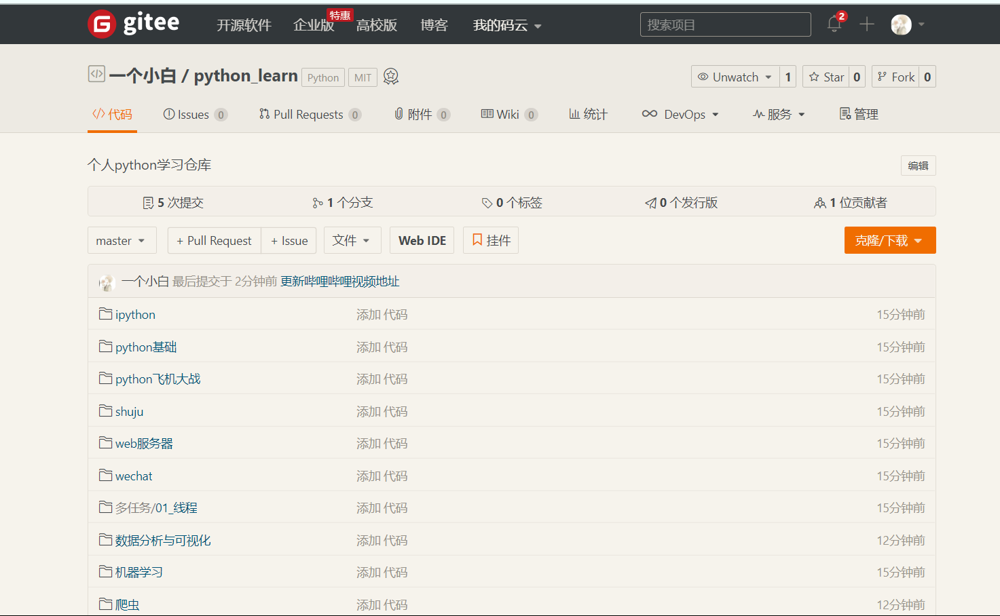

# 黑马程序员所有笔记

> **温馨提示**：最近，国内访问GitHub会因为DNS（域名解析服务）的问题出现**图片无法显示**的情况，如果你也遇到了这样的问题，可以通过**修改本机的`hosts`文件**直接对GitHub的资源链接进行域名解析来加以解决。使用macOS系统的读者可以参考[《macOS 下三种修改 hosts 文件的方法》](<https://www.jianshu.com/p/752211238c1b>)一文来修改`hosts`文件；使用Windows系统的读者可以参考[《在 Windows 上如何管理 hosts 文件》](<https://sspai.com/post/43248>)一文来进行操作。我们可以把下面的内容添加到`hosts`文件的末尾，这样就可以解决GitHub上图片无法显示的问题。

```INI
151.101.184.133    assets-cdn.github.com
151.101.184.133    raw.githubusercontent.com
151.101.184.133    gist.githubusercontent.com
151.101.184.133    cloud.githubusercontent.com
151.101.184.133    camo.githubusercontent.com
```
## 看视频前请看安装Ubuntu文档

这里是安装Ubuntu完整教程：http://note.youdao.com/noteshare?id=8957587fbb0c51826f26a5a4937696ab&sub=D8C2CBEBCC7E4D60A89485794909400E

这里是我整理的python学习路线：（python学习框架.mindmap） http://note.youdao.com/noteshare?id=bd91b8186c01fe305bc1464c7e4bd30b&sub=95524FDDFCF945D4A5E4D2B051B9AF63

这里是谷歌访问助手，轻松上谷歌，找资料从此不用愁：https://github.com/hyh1750522171/google-chrome

## 黑马程序员笔记 jupyter 版本更新啦。。。

- 笔记国内地址：https://gitee.com/muaimingjun/python-video-notebook
- 笔记国外地址：https://github.com/hyh1750522171/python-video-notebook

## 为了大家快速下载，来国内的仓库吧（两个仓库同步更新）

仓库链接: https://gitee.com/muaimingjun/hm_bilibili_book


## 个人python学习仓库

仓库地址：https://gitee.com/muaimingjun/python_learn



* 有问题反馈这里：
* QQ群: [260305404](https://jq.qq.com/?_wv=1027&k=2qrn6xvQ)

* QQ: [2667004988](http://wpa.qq.com/msgrd?v=3&uin=2667004988&site=qq&menu=yes)

* vx: hyh2667004988
* 
