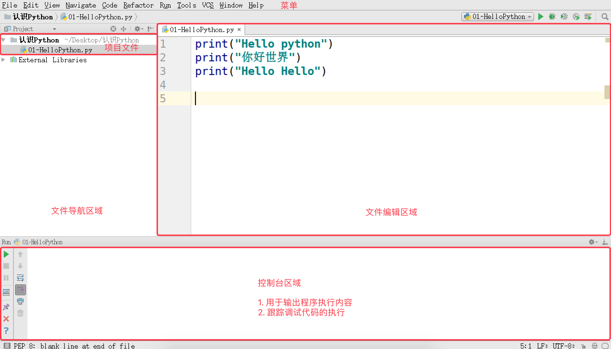
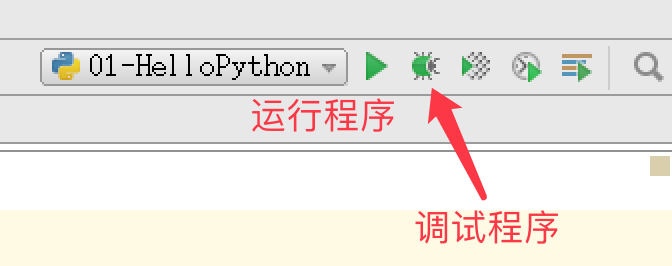
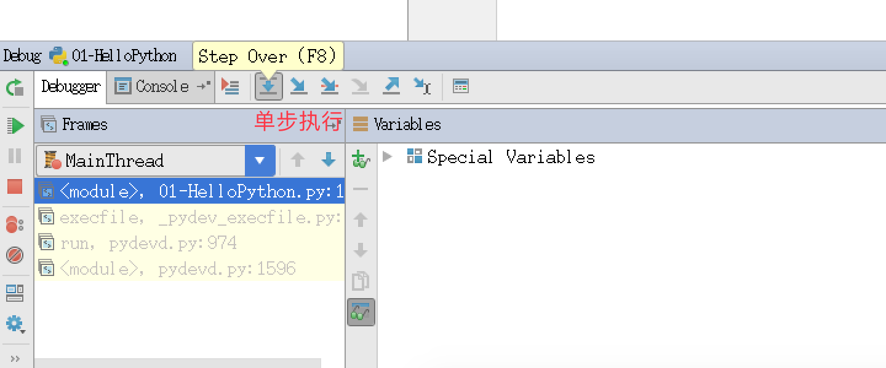

# 第一个 Python 程序

## 目标

* 第一个 `HelloPython` 程序
* `Python 2.x` 与 `3.x` 版本简介
* 执行 `Python` 程序的三种方式
    * 解释器 —— `python` / `python3`
    * 交互式 —— `ipython`
    * 集成开发环境 —— `PyCharm`

## 01. 第一个 `HelloPython` 程序

### 1.1 Python 源程序的基本概念

1. Python 源程序就是**一个特殊格式的文本文件**，可以**使用任意文本编辑软件**做 `Python` 的开发
2. Python 程序的 **文件扩展名** 通常都是 `.py`

### 1.2 演练步骤

* 在桌面下，新建 `认识Python` 目录
* 在 `认识Python` 目录下新建 `01-HelloPython.py` 文件
* 使用 **gedit** 编辑 `01-HelloPython.py` 并且输入以下内容：

```python
print("hello python")
print("hello world")
```

* 在终端中输入以下命令执行 `01-HelloPython.py`

```bash
$ python 01-HelloPython.py
```

> `print` 是 `python` 中我们学习的第一个 **函数**
> 
> `print` 函数的作用，可以把 **""** 内部的内容，输出到屏幕上

### 1.3 演练扩展 —— 认识错误（BUG）

#### 关于错误

* 编写的程序**不能正常执行**，或者**执行的结果不是我们期望的**
* 俗称 `BUG`，是程序员在开发时非常常见的，初学者常见错误的原因包括：
    1. 手误
    2. 对已经学习过的知识理解还存在不足
    3. 对语言还有需要学习和提升的内容
* 在学习语言时，不仅要**学会语言的语法**，而且还要**学会如何认识错误和解决错误的方法**

> 每一个程序员都是在不断地修改错误中成长的

#### 第一个演练中的常见错误

* 1> **手误**，例如使用 `pirnt("Hello world")` 

```
NameError: name 'pirnt' is not defined

名称错误：'pirnt' 名字没有定义
```

* 2> 将多条 `print` 写在一行

```
SyntaxError: invalid syntax

语法错误：语法无效
```

> 每行代码负责完成一个动作

* 3> 缩进错误

```
IndentationError: unexpected indent

缩进错误：不期望出现的缩进
```

> * Python 是一个格式非常严格的程序设计语言
> * 目前而言，大家记住每行代码前面都不要增加空格

* 4> **python 2.x 默认不支持中文** 

目前市场上有两个 Python 的版本并存着，分别是 `Python 2.x` 和 `Python 3.x`

* **Python 2.x 默认不支持中文**，具体原因，等到介绍 **字符编码** 时给大家讲解
* Python 2.x 的解释器名称是 **python**
* Python 3.x 的解释器名称是 **python3**

```
SyntaxError: Non-ASCII character '\xe4' in file 01-HelloPython.py on line 3, 
but no encoding declared; 
see http://python.org/dev/peps/pep-0263/ for details

语法错误： 在 01-HelloPython.py 中第 3 行出现了非 ASCII 字符 '\xe4'，但是没有声明文件编码
请访问 http://python.org/dev/peps/pep-0263/ 了解详细信息
```

> * `ASCII` 字符只包含 `256` 个字符，不支持中文
> * 有关字符编码的问题，后续会讲

#### 单词列表

```
* error 错误
* name 名字
* defined 已经定义
* syntax 语法
* invalid 无效
* Indentation 索引
* unexpected 意外的，不期望的
* character 字符
* line 行
* encoding 编码
* declared 声明
* details 细节，详细信息
* ASCII 一种字符编码
```

## 02. `Python 2.x` 与 `3​​.x` 版本简介

目前市场上有两个 Python 的版本并存着，分别是 `Python 2.x` 和 `Python 3.x`

> 新的 Python 程序建议使用 `Python 3.0` 版本的语法

* Python 2.x 是 **过去的版本**
    * 解释器名称是 **python**
* Python 3.x 是 **现在和未来 主流的版本**
    * 解释器名称是 **python3**
    * 相对于 `Python` 的早期版本，这是一个 **较大的升级**
    * 为了不带入过多的累赘，`Python 3.0` 在设计的时候 **没有考虑向下兼容**
        * 许多早期 `Python` 版本设计的程序都无法在 `Python 3.0` 上正常执行
    * Python 3.0 发布于 **2008 年**
    * 到目前为止，Python 3.0 的稳定版本已经有很多年了
        * Python 3.3 发布于 2012
        * Python 3.4 发布于 2014
        * Python 3.5 发布于 2015
        * Python 3.6 发布于 2016
* 为了照顾现有的程序，官方提供了一个过渡版本 —— **Python 2.6**
    * 基本使用了 `Python 2.x` 的语法和库
    * 同时考虑了向 `Python 3.0` 的迁移，**允许使用部分** `Python 3.0` 的语法与函数
    * 2010 年中推出的 `Python 2.7` 被确定为 **最后一个Python 2.x 版本**

> 提示：如果开发时，无法立即使用 Python 3.0（还有极少的第三方库不支持 3.0 的语法），建议
> 
> * 先使用 `Python 3.0` 版本进行开发
> * 然后使用 `Python 2.6`、`Python 2.7` 来执行，并且做一些兼容性的处理

## 03. 执行 Python 程序的三种方式

### 3.1. 解释器 `python` / `python3`

#### Python 的解释器

```bash
# 使用 python 2.x 解释器
$ python xxx.py

# 使用 python 3.x 解释器
$ python3 xxx.py
```

##### 其他解释器（知道）

**Python 的解释器** 如今有多个语言的实现，包括：

* `CPython` —— 官方版本的 C 语言实现
* `Jython` —— 可以运行在 Java 平台
* `IronPython` —— 可以运行在 .NET 和 Mono 平台
* `PyPy` —— Python 实现的，支持 JIT 即时编译

### 3.2. 交互式运行 Python 程序

* 直接在终端中运行解释器，而不输入要执行的文件名
* 在 Python 的 `Shell` 中直接输入 **Python 的代码**，会立即看到程序执行结果

#### 1) 交互式运行 Python 的优缺点

##### 优点
* 适合于学习/验证 Python 语法或者局部代码

##### 缺点
* 代码不能保存
* 不适合运行太大的程序

#### 2) 退出 官方的解释器

##### 1> 直接输入 `exit()`

```python
>>> exit()
```

##### 2> 使用热键退出

在 python 解释器中，按热键 `ctrl + d` 可以退出解释器


#### 3) IPython

* IPython 中 的 “I” 代表 **交互 interactive**

##### 特点

* IPython 是一个 python 的 **交互式 shell**，比默认的 `python shell` 好用得多
    * 支持自动补全
    * 自动缩进
    * 支持 `bash shell` 命令
    * 内置了许多很有用的功能和函数
* IPython 是基于 BSD 开源的

##### 版本

* Python 2.x 使用的解释器是 **ipython**
* Python 3.x 使用的解释器是 **ipython3**

* 要退出解释器可以有以下两种方式：

##### 1> 直接输入 `exit`

```python
In [1]: exit
```

##### 2> 使用热键退出

在 IPython 解释器中，按热键 `ctrl + d`，`IPython` 会询问是否退出解释器

#### IPython 的安装

```bash
$ sudo apt install ipython
```

## 3.3. Python 的 IDE —— `PyCharm`

### 1） 集成开发环境（IDE）

集成开发环境（`IDE`，Integrated Development Environment）—— **集成了开发软件需要的所有工具**，一般包括以下工具：

* 图形用户界面
* 代码编辑器（支持 **代码补全**／**自动缩进**）
* 编译器／解释器
* 调试器（**断点**／**单步执行**）
* ……

### 2）PyCharm 介绍

* `PyCharm` 是 Python 的一款非常优秀的集成开发环境
* `PyCharm` 除了具有一般 IDE 所必备功能外，还可以在 `Windows`、`Linux`、`macOS` 下使用
* `PyCharm` 适合开发大型项目
    * 一个项目通常会包含 **很多源文件**
    * 每个 **源文件** 的代码行数是有限的，通常在几百行之内
    * 每个 **源文件** 各司其职，共同完成复杂的业务功能

### 3）PyCharm 快速体验



* **文件导航区域** 能够 **浏览**／**定位**／**打开** 项目文件
* **文件编辑区域** 能够 **编辑** 当前打开的文件
* **控制台区域** 能够：
    * 输出程序执行内容
    * 跟踪调试代码的执行
* 右上角的 **工具栏** 能够 **执行(SHIFT + F10)** / **调试(SHIFT + F9)** 代码



* 通过控制台上方的**单步执行按钮(F8)**，可以单步执行代码

