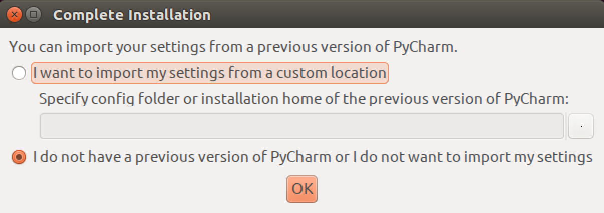
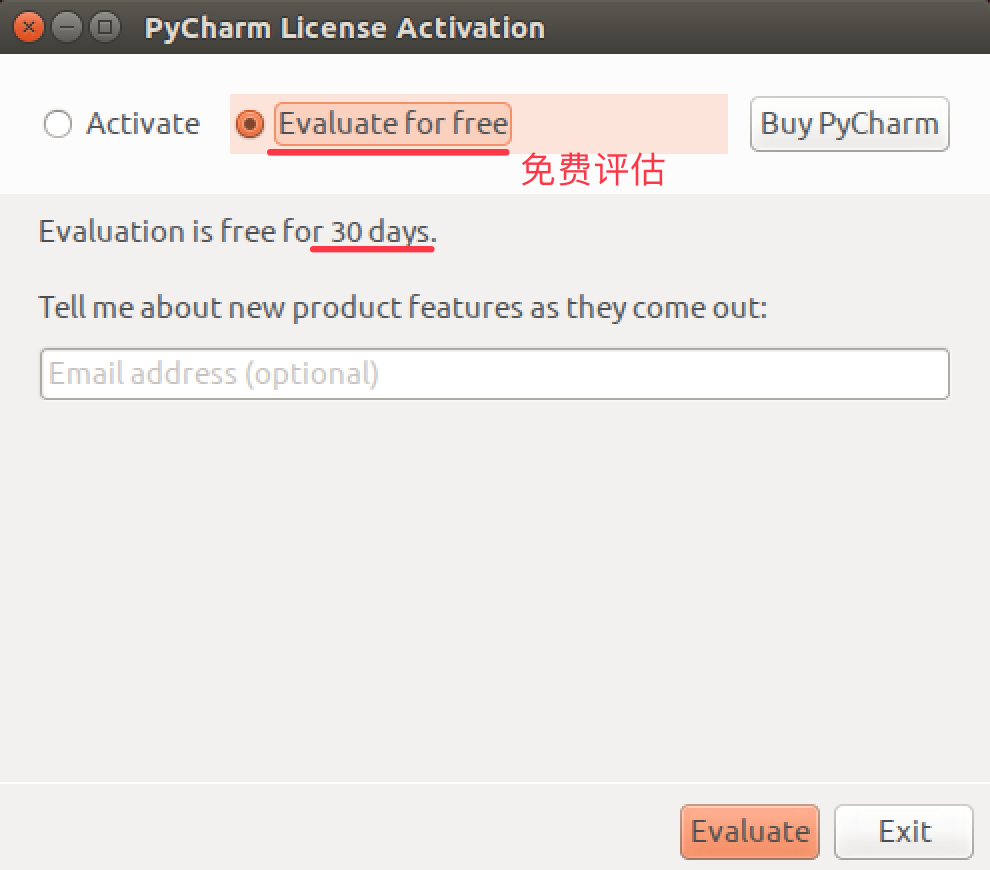
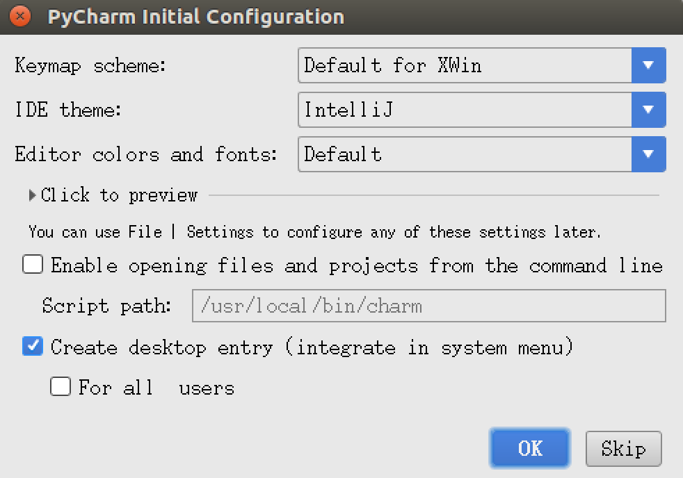
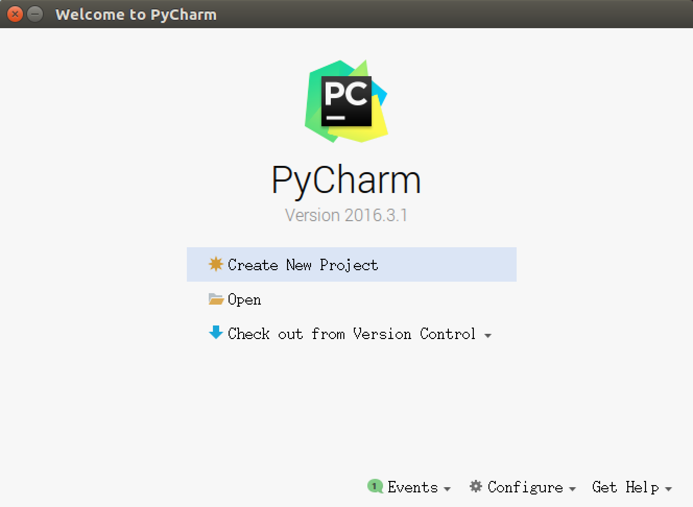
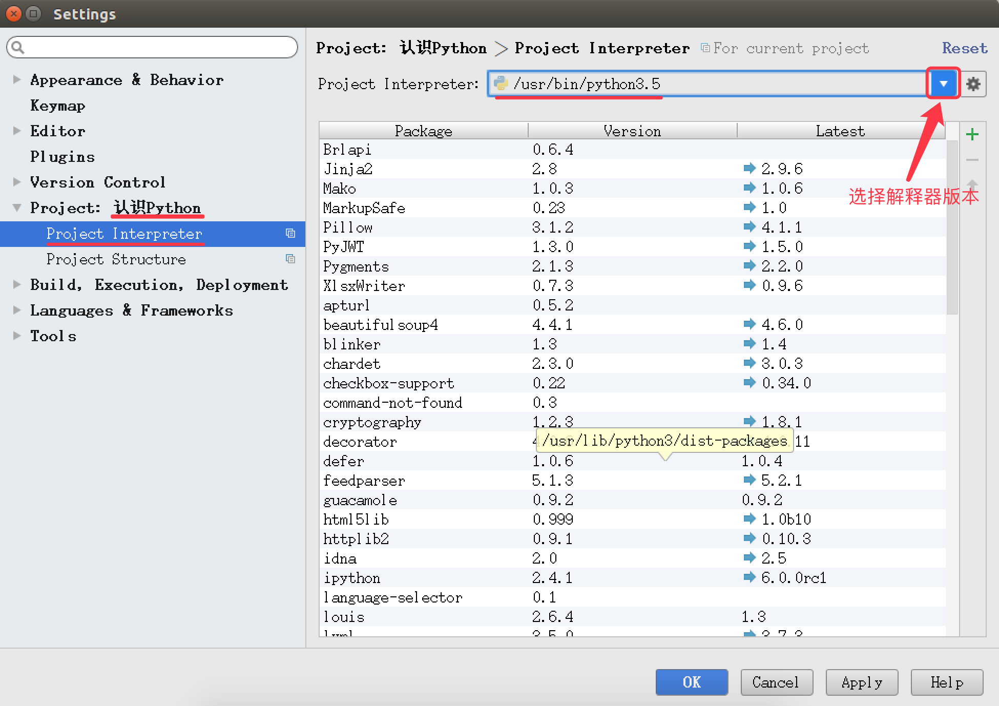
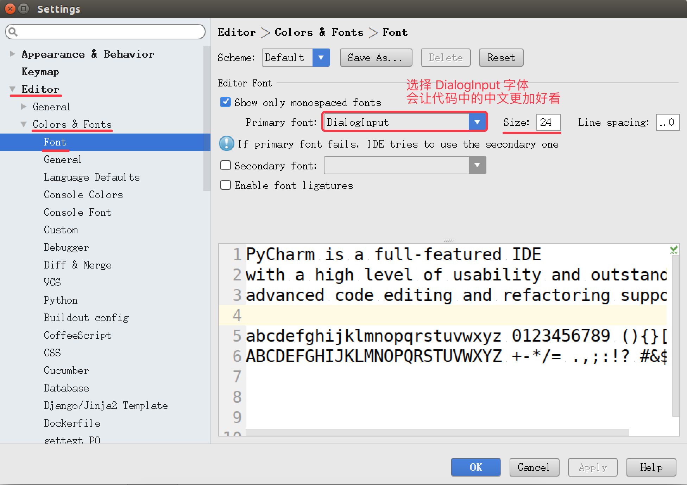
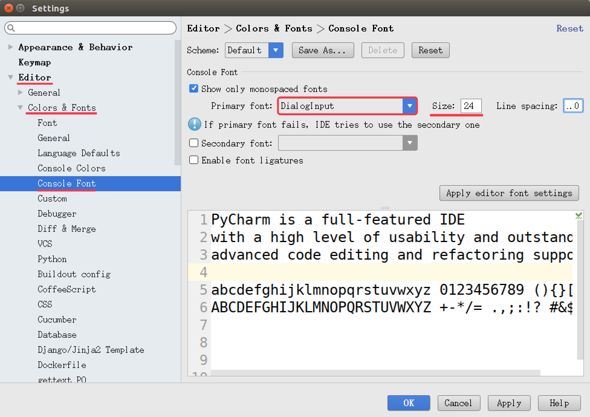
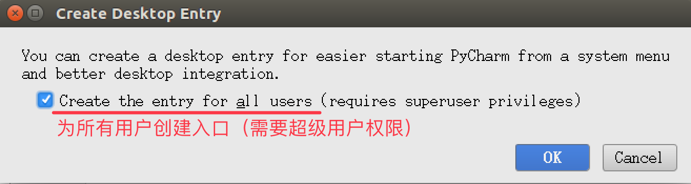

# PyCharm 的初始设置（知道）

## 目标

* 恢复 PyCharm 的初始设置
* 第一次启动 PyCharm
* 新建一个 Python 项目
* 设置 PyCharm 的字体显示
* PyCharm 的升级以及其他

PyCharm 的官方网站地址是：https://www.jetbrains.com/pycharm/

## 01. 恢复 PyCharm 的初始设置

`PyCharm` 的 **配置信息** 是保存在 **用户家目录下** 的 `.PyCharmxxxx.x` 目录下的，`xxxx.x` 表示当前使用的 `PyCharm` 的版本号

如果要恢复 `PyCharm` 的初始设置，可以按照以下步骤进行：

* 1. 关闭正在运行的 `PyCharm`
* 2. 在终端中执行以下终端命令，删除 `PyCharm` 的配置信息目录：

```bash
$ rm -r ~/.PyCharm2016.3
```

* 3. 重新启动 `PyCharm`

## 02. 第一次启动 PyCharm

1. 导入配置信息
2. 选择许可协议
3. 配置初始界面

### 2.1 导入配置信息

* 在第一次启动 `PyCharm` 时，会首先提示用户是否导入 **之前的配置信息**
* 如果是第一次使用，直接点击 **OK** 按钮



### 2.2 选择许可协议

* PyCharm 是一个付费软件，购买费用为 **199$ / 年** 或者 **19.90$ ／ 月**
* 不过 PyCharm 提供了对 **学生和教师免费使用的版本**
    * 下载地址是：https://www.jetbrains.com/pycharm-edu/download/#section=linux
* 商业版本会提示输入注册信息，或者选择免费评估



### 2.3 PyCharm 的配置初始界面

* 在初始配置界面，可以通过 `Editor colors and fonts` 选择 **编辑器的配色方案**



### 2.4 欢迎界面

* 所有基础配置工作结束之后，就可以看到 `PyCharm` 的 **欢迎界面**了，通过 **欢迎界面** 就可以开始开发 Python 项目了



## 03. 新建/打开一个 Python 项目

### 3.1 项目简介

* 开发 **项目** 就是开发一个 **专门解决一个复杂业务功能的软件**
* 通常每 **一个项目** 就具有一个 **独立专属的目录**，用于保存 **所有和项目相关的文件**
    * 一个项目通常会包含 **很多源文件**

### 3.2 打开 Python 项目

* 直接点击 **Open** 按钮，然后浏览到之前保存 **Python 文件的目录**，既可以打开项目
* 打开之后，会在目录下新建一个 `.idea` 的目录，用于保存 **项目相关的信息**，例如：**解释器版本**、**项目包含的文件**等等
* 第一次打开项目，需要耐心等待 `PyCharm` 对项目**进行初始设置**


#### 设置项目使用的解释器版本

* 打开的目录如果不是由 `PyCharm` 建立的项目目录，**有的时候** 使用的解释器版本是 `Python 2.x` 的，需要**单独设置解释器的版本**
* 通过 **File** / **Settings...** 可以打开设置窗口，如下图所示：



### 3.3 新建项目

#### 1) 命名规则

* 以后 **项目名** 前面都以 **数字编号**，**随着知识点递增，编号递增**
    * 例如：**01_Python 基础**、**02_分支**、**03_循环**...
* 每个项目下的 **文件名** 都以 `hm_xx_知识点` 方式来命名
    * 其中 **xx** 是演练文件的序号

* 注意
    * 1. 命名文件名时建议只使用 **小写字母**、**数字** 和 **下划线**
    * 2. **文件名不能以数字开始**

* 通过 **欢迎界面** 或者菜单 **File** / **New Project** 可以新建项目

#### 2) 演练步骤

* 新建 `01_Python基础` 项目，使用 **Python 3.x 解释器**
* 在项目下新建 `hm_01_hello.py` Python 文件
* 编写 `print("Hello Python")` 代码

## 04. 设置 PyCharm 的字体显示





## 05. PyCharm 的升级以及其他

> PyCharm 提供了对 **学生和教师免费使用的版本**

* 教育版下载地址：https://www.jetbrains.com/pycharm-edu/download/#section=linux
* 专业版下载地址：https://www.jetbrains.com/pycharm/download/#section=linux

### 5.1 安装和启动步骤

* 1. 执行以下终端命令，解压缩下载后的安装包

```bash
$ tar -zxvf pycharm-professional-2017.1.3.tar.gz
```

* 2. 将解压缩后的目录移动到 `/opt` 目录下，可以方便其他用户使用

> `/opt` 目录用户存放给主机额外安装的软件

```bash
$ sudo mv pycharm-2017.1.3/ /opt/
```

* 3. 切换工作目录

```bash
$ cd /opt/pycharm-2017.1.3/bin
```

* 4. 启动 `PyCharm`

```bash
$ ./pycharm.sh
```

### 5.2 设置专业版启动图标

* 在**专业版**中，选择菜单 **Tools** / **Create Desktop Entry...** 可以设置任务栏启动图标
    * 注意：设置图标时，需要勾选 `Create the entry for all users`



### 5.3 卸载之前版本的 PyCharm 

#### 1) 程序安装

* 1. **程序文件目录** 
    * 将安装包解压缩，并且移动到 `/opt` 目录下
    * **所有的相关文件都保存在解压缩的目录中**
* 2. **配置文件目录**
    * 启动 `PyCharm` 后，会在用户家目录下建立一个 `.PyCharmxxx` 的隐藏目录
    * **保存 `PyCharm` 相关的配置信息**
* 3. **快捷方式文件**
    * `/usr/share/applications/jetbrains-pycharm.desktop` 

> 在 `ubuntu` 中，应用程序启动的快捷方式通常都保存在 `/usr/share/applications` 目录下

#### 2) 程序卸载

* 要卸载 `PyCharm` 只需要做以下两步工作：

* 1. 删除解压缩目录

```bash
$ sudo rm -r /opt/pycharm-2016.3.1/
```

* 2. 删除家目录下用于保存配置信息的隐藏目录

```bash
$ rm -r ~/.PyCharm2016.3/
```

> 如果不再使用 PyCharm 还需要将 `/usr/share/applications/` 下的 `jetbrains-pycharm.desktop` 删掉

### 5.4 教育版安装演练

```bash
# 1. 解压缩下载后的安装包
$ tar -zxvf pycharm-edu-3.5.1.tar.gz

# 2. 将解压缩后的目录移动到 `/opt` 目录下，可以方便其他用户使用
$ sudo mv pycharm-edu-3.5.1/ /opt/

# 3. 启动 `PyCharm`
/opt/pycharm-edu-3.5.1/bin/pycharm.sh
```

> 后续课程**都使用专业版本演练**

#### 设置启动图标

* 1. 编辑快捷方式文件

```bash
$ sudo gedit /usr/share/applications/jetbrains-pycharm.desktop
```

* 3. 按照以下内容修改文件内容，需要注意**指定正确的 `pycharm` 目录**

```
[Desktop Entry]
Version=1.0
Type=Application
Name=PyCharm
Icon=/opt/pycharm-edu-3.5.1/bin/pycharm.png
Exec="/opt/pycharm-edu-3.5.1/bin/pycharm.sh" %f
Comment=The Drive to Develop
Categories=Development;IDE;
Terminal=false
StartupWMClass=jetbrains-pycharm
```
