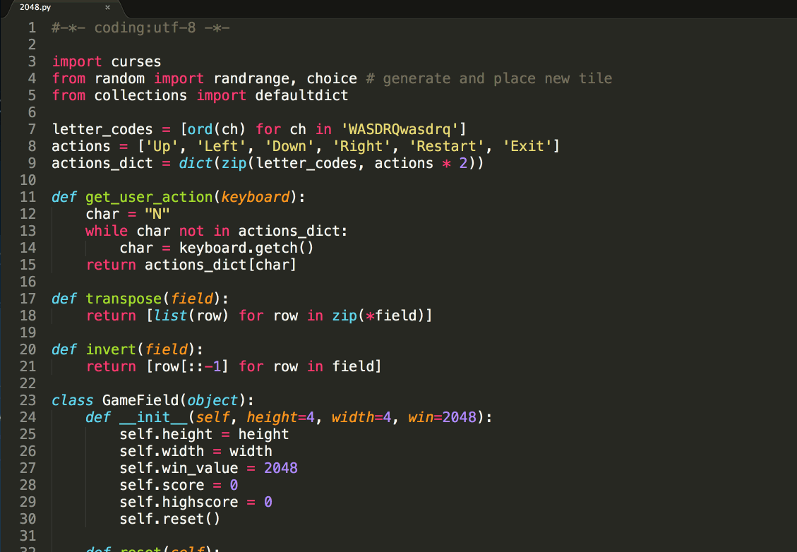

# 注释

## 目标

* 注释的作用
* 单行注释（行注释）
* 多行注释（块注释）

## 01. 注释的作用

> 使用用自己熟悉的语言，在程序中对某些代码进行标注说明，增强程序的可读性



## 02. 单行注释(行注释)

* 以 `#` 开头，`#` 右边的所有东西都被当做说明文字，而不是真正要执行的程序，只起到辅助说明作用

* 示例代码如下：

```python
# 这是第一个单行注释
print("hello python")
```

> 为了保证代码的可读性，`#` 后面建议先添加一个空格，然后再编写相应的说明文字

### 在代码后面增加的单行注释

* 在程序开发时，同样可以使用 `#` 在代码的后面（旁边）增加说明性的文字
* 但是，需要注意的是，**为了保证代码的可读性**，**注释和代码之间** 至少要有 **两个空格**

* 示例代码如下：

```python
print("hello python")  # 输出 `hello python`
```

## 03. 多行注释（块注释）

* 如果希望编写的 **注释信息很多，一行无法显示**，就可以使用多行注释
* 要在 Python 程序中使用多行注释，可以用 **一对 连续的 三个 引号**(单引号和双引号都可以)

* 示例代码如下：

```python
"""
这是一个多行注释

在多行注释之间，可以写很多很多的内容……
""" 
print("hello python")
```

### 什么时候需要使用注释？

1. **注释不是越多越好**，对于一目了然的代码，不需要添加注释
2. 对于 **复杂的操作**，应该在操作开始前写上若干行注释
3. 对于 **不是一目了然的代码**，应在其行尾添加注释（为了提高可读性，注释应该至少离开代码 2 个空格）
4. 绝不要描述代码，假设阅读代码的人比你更懂 Python，他只是不知道你的代码要做什么

> 在一些正规的开发团队，通常会有 **代码审核** 的惯例，就是一个团队中彼此阅读对方的代码


### 关于代码规范

* `Python` 官方提供有一系列 PEP（Python Enhancement Proposals） 文档
* 其中第 8 篇文档专门针对 **Python 的代码格式** 给出了建议，也就是俗称的 **PEP 8**
* 文档地址：https://www.python.org/dev/peps/pep-0008/
* 谷歌有对应的中文文档：http://zh-google-styleguide.readthedocs.io/en/latest/google-python-styleguide/python_style_rules/

> 任何语言的程序员，编写出符合规范的代码，是开始程序生涯的第一步


