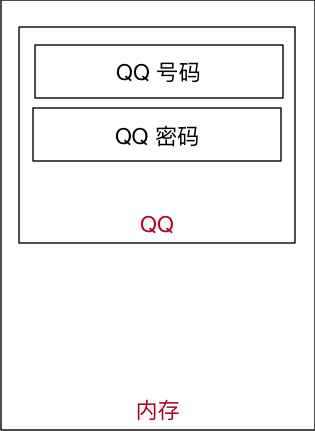

# 程序执行原理（科普）

## 目标

* 计算机中的 **三大件**
* 程序执行的原理
* 程序的作用

## 01. 计算机中的三大件

计算机中包含有较多的硬件，但是一个程序要运行，有 **三个** 核心的硬件，分别是：

1. **CPU** 
    * 中央处理器，是一块超大规模的集成电路
    * 负责 **处理数据**／**计算**
2. **内存**
    * **临时** 存储数据（断电之后，数据会消失）
    * 速度快
    * 空间小（单位价格高）
3. **硬盘** 
    * **永久** 存储数据
    * 速度慢
    * 空间大（单位价格低）

| CPU | 内存 | 硬盘 |
| :---: | :---: | :---: |
|  |    |  |

### 思考题

1. 计算机中哪一个硬件设备负责执行程序？
    * **CPU**
2. **内存** 的速度快还是 **硬盘** 的速度快？
    * **内存**
3. 我们的程序是安装在内存中的，还是安装在硬盘中的？
    * 硬盘
4. **我买了一个内存条，有 500G 的空间！！！**，这句话对吗？
    * 不对，内存条通常只有 `4G` / `8G` / `16G` / `32G`
5. **计算机关机之后，内存中的数据都会消失**，这句话对吗？
    * 正确 

## 02. 程序执行的原理


1. 程序 **运行之前**，程序是 **保存在硬盘** 中的
2. 当要运行一个程序时
    * 操作系统会首先让 **CPU** 把程序复制到 **内存** 中
    * **CPU** 执行 **内存** 中的 **程序代码**

> **程序要执行，首先要被加载到内存**

### 2.1 Python 程序执行原理


1. 操作系统会首先让 **CPU** 把 **Python 解释器** 的程序复制到 **内存** 中
2. **Python 解释器** 根据语法规则，**从上向下** 让 **CPU** 翻译 **Python 程序中的代码**
3. **CPU** 负责执行翻译完成的代码

#### Python 的解释器有多大？

* 执行以下终端命令可以查看 Python 解释器的大小

```bash
# 1. 确认解释器所在位置
$ which python

# 2. 查看 python 文件大小(只是一个软链接)
$ ls -lh /usr/bin/python

# 3. 查看具体文件大小
$ ls -lh /usr/bin/python2.7
```

> 提示：建立 **软链接** 的目的，是为了方便使用者不用记住使用的解释器是 **哪一个具体版本**

## 03. 程序的作用

> 程序就是 **用来处理数据** 的！

* **新闻软件** 提供的 **新闻内容、评论……** 是数据
* **电商软件** 提供的 **商品信息、配送信息……** 是数据
* **运动类软件** 提供的 **运动数据……** 是数据
* **地图类软件** 提供的 **地图信息、定位信息、车辆信息……** 是数据
* **即时通讯软件** 提供的 **聊天信息、好友信息……** 是数据
* ……

### 3.1 思考 QQ 程序的启动过程

1. QQ 在**运行之前**，是保存在 **硬盘** 中的
2. **运行之后**，QQ 程序就会被加载到 **内存** 中了


### 3.2 思考 QQ 程序的 **登录** 过程

1. 读取用户输入的 **QQ 号码**
2. 读取用户输入的 **QQ 密码**
3. 将 **QQ 号码** 和 **QQ 密码** 发送给腾讯的服务器，等待服务器确认用户信息

#### 思考 1

> 在 QQ 这个程序将 **QQ 号码** 和 **QQ 密码** 发送给服务器之前，**是否需要先存储一下 QQ 号码 和 密码?**

**答案**

肯定需要！—— 否则 QQ 这个程序就不知道把什么内容发送给服务器了！

#### 思考 2

> QQ 这个程序把 **QQ 号码** 和 **QQ 密码** 保存在哪里？

**答案**

保存在 **内存** 中，因为 QQ 程序自己就在内存中

#### 思考 3

> QQ 这个程序是怎么保存用户的 **QQ 号码** 和 **QQ 密码** 的？

**答案**

1. 在内存中为 **QQ 号码** 和 **QQ 密码** 各自分配一块空间
    * 在 QQ 程序结束之前，这两块空间是由 QQ 程序负责管理的，其他任何程序都不允许使用
    * 在 QQ 自己使用完成之前，这两块空间始终都只负责保存 **QQ 号码** 和 **QQ 密码**
2. 使用一个 **别名** 标记 **QQ 号码** 和 **QQ 密码** 在内存中的位置



> * 在程序内部，为 **QQ 号码** 和 **QQ 密码** 在内存中分配的空间就叫做 **变量**
> * **程序就是用来处理数据的，而变量就是用来存储数据的**


