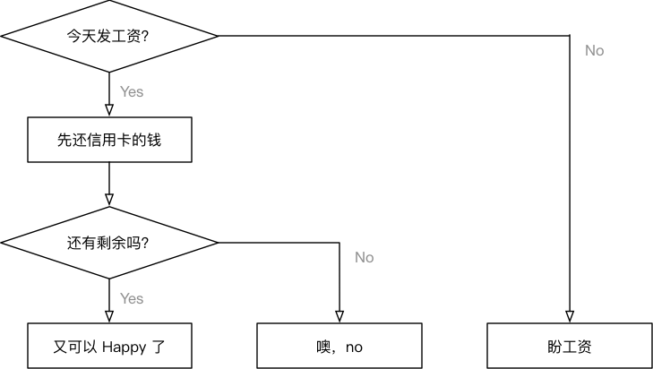
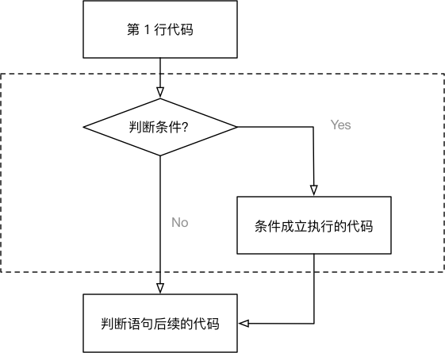
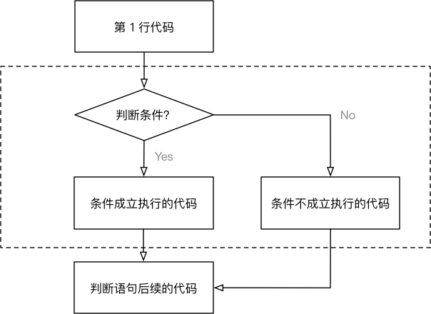

# 判断（if）语句

## 目标

* 开发中的应用场景
* if 语句体验
* if 语句进阶
* 综合应用

## 01. 开发中的应用场景

生活中的判断几乎是无所不在的，我们每天都在做各种各样的选择，如果这样？如果那样？……


### 程序中的判断



```python
if 今天发工资:

    先还信用卡的钱

    if 有剩余:

        又可以happy了，O(∩_∩)O哈哈~

    else:

        噢，no。。。还的等30天
else:

    盼着发工资
```

### 判断的定义

* 如果 **条件满足**，才能做某件事情，
* 如果 **条件不满足**，就做另外一件事情，或者什么也不做

> 正是因为有了判断，才使得程序世界丰富多彩，充满变化！
>
> **判断语句** 又被称为 “分支语句”，正是因为有了判断，才让程序有了很多的分支

## 02. if 语句体验

### 2.1 if 判断语句基本语法

在 `Python` 中，**if 语句** 就是用来进行判断的，格式如下：

```python
if 要判断的条件:
    条件成立时，要做的事情
    ……
```

> 注意：代码的缩进为一个 `tab` 键，或者 **4** 个空格 —— **建议使用空格**
> 
> * 在 Python 开发中，Tab 和空格不要混用！

**我们可以把整个 if 语句看成一个完整的代码块**



### 2.2 判断语句演练 —— 判断年龄

**需求**

1. 定义一个整数变量记录年龄
2. 判断是否满 18 岁 （**>=**）
3. 如果满 18 岁，允许进网吧嗨皮

```python
# 1. 定义年龄变量
age = 18

# 2. 判断是否满 18 岁
# if 语句以及缩进部分的代码是一个完整的代码块
if age >= 18:
    print("可以进网吧嗨皮……")

# 3. 思考！- 无论条件是否满足都会执行
print("这句代码什么时候执行?")
```

**注意**：

* `if` 语句以及缩进部分是一个 **完整的代码块**

### 2.3 else 处理条件不满足的情况

**思考**

在使用 `if` 判断时，只能做到满足条件时要做的事情。那如果需要在 **不满足条件的时候**，做某些事情，该如何做呢？

**答案**

`else`，格式如下：

```python
if 要判断的条件:
    条件成立时，要做的事情
    ……
else:
    条件不成立时，要做的事情
    ……
```

**注意**：

* `if` 和 `else` 语句以及各自的缩进部分共同是一个 **完整的代码块**

### 2.4 判断语句演练 —— 判断年龄改进

**需求**

1. 输入用户年龄
2. 判断是否满 18 岁 （**>=**）
3. 如果满 18 岁，允许进网吧嗨皮
4. 如果未满 18 岁，提示回家写作业

```python
# 1. 输入用户年龄
age = int(input("今年多大了？"))

# 2. 判断是否满 18 岁
# if 语句以及缩进部分的代码是一个完整的语法块
if age >= 18:
    print("可以进网吧嗨皮……")
else:
    print("你还没长大，应该回家写作业！")

# 3. 思考！- 无论条件是否满足都会执行
print("这句代码什么时候执行?")
```



## 03. 逻辑运算

* 在程序开发中，通常 **在判断条件时**，会需要同时判断多个条件
* 只有多个条件都满足，才能够执行后续代码，这个时候需要使用到 **逻辑运算符**
* **逻辑运算符** 可以把 **多个条件** 按照 **逻辑** 进行 **连接**，变成 **更复杂的条件**
* Python 中的 **逻辑运算符** 包括：**与 and**／**或 or**／**非 not** 三种

### 3.1 `and`

```
条件1 and 条件2
```

* **与**／**并且**
* 两个条件同时满足，返回 `True`
* 只要有一个不满足，就返回 `False`

| 条件 1 | 条件 2 | 结果 |
| :---: | :---: | :---: |
| 成立 | 成立 | 成立 |
| 成立 | 不成立 | 不成立 |
| 不成立 | 成立 | 不成立 |
| 不成立 | 不成立 | 不成立 |

### 3.2 `or`

```
条件1 or 条件2
```

* **或**／**或者**
* 两个条件只要有一个满足，返回 `True`
* 两个条件都不满足，返回 `False`

| 条件 1 | 条件 2 | 结果 |
| :---: | :---: | :---: |
| 成立 | 成立 | 成立 |
| 成立 | 不成立 | 成立 |
| 不成立 | 成立 | 成立 |
| 不成立 | 不成立 | 不成立 |

### 3.3 `not`

```
not 条件
```

* **非**／**不是**

| 条件 | 结果 |
| :---: | :---: |
| 成立 | 不成立 |
| 不成立 | 成立 |

#### 逻辑运算演练

1. 练习1: 定义一个整数变量 `age`，编写代码判断年龄是否正确
    * 要求人的年龄在 0-120 之间
2. 练习2: 定义两个整数变量 `python_score`、`c_score`，编写代码判断成绩
    * 要求只要有一门成绩 > 60 分就算合格
3. 练习3: 定义一个布尔型变量 `is_employee`，编写代码判断是否是本公司员工
    * 如果不是提示不允许入内

答案 1：

```python
# 练习1: 定义一个整数变量 age，编写代码判断年龄是否正确
age = 100

# 要求人的年龄在 0-120 之间
if age >= 0 and age <= 120:
    print("年龄正确")
else:
    print("年龄不正确")

```

答案 2：

```python
# 练习2: 定义两个整数变量 python_score、c_score，编写代码判断成绩
python_score = 50
c_score = 50

# 要求只要有一门成绩 > 60 分就算合格
if python_score > 60 or c_score > 60:
    print("考试通过")
else:
    print("再接再厉！")
```

答案 3：

```python
# 练习3: 定义一个布尔型变量 `is_employee`，编写代码判断是否是本公司员工
is_employee = True

# 如果不是提示不允许入内
if not is_employee:
    print("非公勿内")
```

## 04. if 语句进阶

### 4.1 `elif`

* 在开发中，使用 `if` 可以 **判断条件**
* 使用 `else` 可以处理 **条件不成立** 的情况
* 但是，如果希望 **再增加一些条件**，**条件不同，需要执行的代码也不同** 时，就可以使用 `elif` 
* 语法格式如下：

```python
if 条件1:
    条件1满足执行的代码
    ……
elif 条件2:
    条件2满足时，执行的代码
    ……
elif 条件3:
    条件3满足时，执行的代码
    ……
else:
    以上条件都不满足时，执行的代码
    ……
```

* 对比逻辑运算符的代码

```python
if 条件1 and 条件2:
    条件1满足 并且 条件2满足 执行的代码
    ……
```

**注意**

1. `elif` 和 `else` 都必须和 `if` 联合使用，而不能单独使用
2. 可以将 `if`、`elif` 和 `else` 以及各自缩进的代码，看成一个 **完整的代码块**

#### elif 演练 —— 女友的节日

**需求**

1. 定义 `holiday_name` 字符串变量记录节日名称
2. 如果是 **情人节** 应该 **买玫瑰**／**看电影**
3. 如果是 **平安夜** 应该 **买苹果**／**吃大餐**
4. 如果是 **生日** 应该 **买蛋糕**
5. 其他的日子每天都是节日啊……

```
holiday_name = "平安夜"

if holiday_name == "情人节":
    print("买玫瑰")
    print("看电影")
elif holiday_name == "平安夜":
    print("买苹果")
    print("吃大餐")
elif holiday_name == "生日":
    print("买蛋糕")
else:
    print("每天都是节日啊……")

```

### 4.2 `if` 的嵌套


> **elif** 的应用场景是：**同时** 判断 **多个条件**，所有的条件是 **平级** 的

* 在开发中，使用 `if` 进行条件判断，如果希望 **在条件成立的执行语句中** 再 **增加条件判断**，就可以使用 **if 的嵌套**
* **if 的嵌套** 的应用场景就是：**在之前条件满足的前提下，再增加额外的判断**
* **if 的嵌套** 的语法格式，**除了缩进之外** 和之前的没有区别
* 语法格式如下：

```python
if 条件 1:
    条件 1 满足执行的代码
    ……
    
    if 条件 1 基础上的条件 2:
        条件 2 满足时，执行的代码
        ……    
        
    # 条件 2 不满足的处理
    else:
        条件 2 不满足时，执行的代码
        
# 条件 1 不满足的处理
else:
    条件1 不满足时，执行的代码
    ……
```

#### if 的嵌套 演练 —— 火车站安检

**需求**

1. 定义布尔型变量 `has_ticket` 表示是否有车票
2. 定义整型变量 `knife_length` 表示刀的长度，单位：厘米
3. 首先检查是否有车票，如果有，才允许进行 **安检**
4. 安检时，需要检查刀的长度，判断是否超过 20 厘米
    * 如果超过 20 厘米，提示刀的长度，不允许上车
    * 如果不超过 20 厘米，安检通过
5. 如果没有车票，不允许进门

```python
# 定义布尔型变量 has_ticket 表示是否有车票
has_ticket = True

# 定义整数型变量 knife_length 表示刀的长度，单位：厘米
knife_length = 20

# 首先检查是否有车票，如果有，才允许进行 安检
if has_ticket:
    print("有车票，可以开始安检...")

    # 安检时，需要检查刀的长度，判断是否超过 20 厘米
    # 如果超过 20 厘米，提示刀的长度，不允许上车
    if knife_length >= 20:
        print("不允许携带 %d 厘米长的刀上车" % knife_length)
    # 如果不超过 20 厘米，安检通过
    else:
        print("安检通过，祝您旅途愉快……")

# 如果没有车票，不允许进门
else:
    print("大哥，您要先买票啊")

```

## 05. 综合应用 —— 石头剪刀布

**目标**

1. 强化 **多个条件** 的 **逻辑运算**
2. 体会 `import` 导入模块（“工具包”）的使用

**需求**

1. 从控制台输入要出的拳 —— 石头（1）／剪刀（2）／布（3）
2. 电脑 **随机** 出拳 —— 先假定电脑只会出石头，完成整体代码功能
3. 比较胜负

| 序号 | 规则 |
| :---: | :---: |
| 1 | 石头 胜 剪刀 |
| 2 | 剪刀 胜 布 | 
| 3 | 布 胜 石头 |

### 5.1 基础代码实现

* 先 **假定电脑就只会出石头**，完成整体代码功能

```python
# 从控制台输入要出的拳 —— 石头（1）／剪刀（2）／布（3）
player = int(input("请出拳 石头（1）／剪刀（2）／布（3）："))

# 电脑 随机 出拳 - 假定电脑永远出石头
computer = 1

# 比较胜负
# 如果条件判断的内容太长，可以在最外侧的条件增加一对大括号
# 再在每一个条件之间，使用回车，PyCharm 可以自动增加 8 个空格
if ((player == 1 and computer == 2) or
        (player == 2 and computer == 3) or
        (player == 3 and computer == 1)):

    print("噢耶！！！电脑弱爆了！！！")
elif player == computer:
    print("心有灵犀，再来一盘！")
else:
    print("不行，我要和你决战到天亮！")

```

### 5.2 随机数的处理

* 在 `Python` 中，要使用随机数，首先需要导入 **随机数** 的 **模块** —— “工具包”

```python
import random
```

* 导入模块后，可以直接在 **模块名称** 后面敲一个 `.` 然后按 `Tab` 键，会提示该模块中包含的所有函数

* `random.randint(a, b)` ，返回 `[a, b]` 之间的整数，包含 `a` 和 `b`
* 例如：

```python
random.randint(12, 20)  # 生成的随机数n: 12 <= n <= 20   
random.randint(20, 20)  # 结果永远是 20   
random.randint(20, 10)  # 该语句是错误的，下限必须小于上限
```


