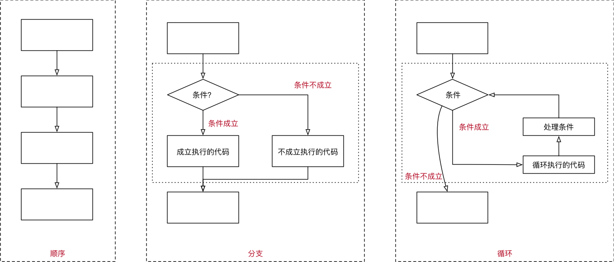
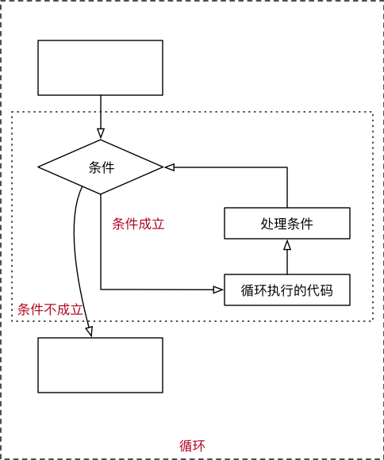

# 循环

## 目标

* 程序的三大流程
* while 循环基本使用
* break 和 continue
* while 循环嵌套

## 01. 程序的三大流程

* 在程序开发中，一共有三种流程方式：
    * **顺序** —— **从上向下**，顺序执行代码
    * **分支** —— 根据条件判断，决定执行代码的 **分支**
    * **循环** —— 让 **特定代码 重复** 执行

    


## 02. `while` 循环基本使用

* 循环的作用就是让 **指定的代码** 重复的执行
* `while` 循环最常用的应用场景就是 **让执行的代码** 按照 **指定的次数** **重复** 执行

* 需求 —— 打印 5 遍 `Hello Python`
* 思考 —— 如果要求打印 100 遍怎么办？

### 2.1 `while` 语句基本语法

```python
初始条件设置 —— 通常是重复执行的 计数器

while 条件(判断 计数器 是否达到 目标次数):
    条件满足时，做的事情1
    条件满足时，做的事情2
    条件满足时，做的事情3
    ...(省略)...
    
    处理条件(计数器 + 1)
```

**注意**：

* `while` 语句以及缩进部分是一个 **完整的代码块**

#### 第一个 while 循环

**需求**

* 打印 5 遍 Hello Python

```while
# 1. 定义重复次数计数器
i = 1

# 2. 使用 while 判断条件
while i <= 5:
    # 要重复执行的代码
    print("Hello Python")

    # 处理计数器 i
    i = i + 1

print("循环结束后的 i = %d" % i)
```

> 注意：循环结束后，之前定义的计数器条件的数值是依旧存在的

#### 死循环

> 由于程序员的原因，**忘记** 在循环内部 **修改循环的判断条件**，导致循环持续执行，程序无法终止！

### 2.2 赋值运算符

* 在 Python 中，使用 `=` 可以给变量赋值
* 在算术运算时，为了简化代码的编写，`Python` 还提供了一系列的 与 **算术运算符** 对应的 **赋值运算符**
* 注意：**赋值运算符中间不能使用空格**

| 运算符 | 描述 | 实例 |
| --- | --- | --- |
| = | 简单的赋值运算符 | c = a + b 将 a + b 的运算结果赋值为 c |
| += | 加法赋值运算符 | c += a 等效于 c = c + a |
| -= | 减法赋值运算符 | c -= a 等效于 c = c - a |
| *= | 乘法赋值运算符	 | c *= a 等效于 c = c * a |
| /= | 除法赋值运算符 | c /= a 等效于 c = c / a |
| //= | 取整除赋值运算符 | c //= a 等效于 c = c // a |
| %= | 取 **模** (余数)赋值运算符 | c %= a 等效于 c = c % a |
| **= | 幂赋值运算符 | c **= a 等效于 c = c ** a |

### 2.3 Python 中的计数方法

常见的计数方法有两种，可以分别称为：

* **自然计数法**（从 `1` 开始）—— 更符合人类的习惯
* **程序计数法**（从 `0` 开始）—— 几乎所有的程序语言都选择从 0 开始计数

因此，大家在编写程序时，应该尽量养成习惯：**除非需求的特殊要求，否则 循环 的计数都从 0 开始**

### 2.4 循环计算

> 在程序开发中，通常会遇到 **利用循环** **重复计算** 的需求

遇到这种需求，可以：

1. 在 `while` 上方定义一个变量，用于 **存放最终计算结果**
2. 在循环体内部，每次循环都用 **最新的计算结果**，**更新** 之前定义的变量

**需求**

* 计算 0 ~ 100 之间所有数字的累计求和结果

```python
# 计算 0 ~ 100 之间所有数字的累计求和结果
# 0. 定义最终结果的变量
result = 0

# 1. 定义一个整数的变量记录循环的次数
i = 0

# 2. 开始循环
while i <= 100:
    print(i)

    # 每一次循环，都让 result 这个变量和 i 这个计数器相加
    result += i

    # 处理计数器
    i += 1

print("0~100之间的数字求和结果 = %d" % result)

```

#### 需求进阶

* 计算 0 ~ 100 之间 所有 **偶数** 的累计求和结果

开发步骤

1. 编写循环 **确认** **要计算的数字**
2. 添加 **结果** 变量，在循环内部 **处理计算结果**

```python
# 0. 最终结果
result = 0

# 1. 计数器
i = 0

# 2. 开始循环
while i <= 100:

    # 判断偶数
    if i % 2 == 0:
        print(i)
        result += i

    # 处理计数器
    i += 1

print("0~100之间偶数求和结果 = %d" % result)

```

## 03. break 和 continue

> `break` 和 `continue` 是专门在循环中使用的关键字

* `break` **某一条件满足时**，退出循环，不再执行后续重复的代码
* `continue` **某一条件满足时**，不执行后续重复的代码

> `break` 和 `continue` 只针对 **当前所在循环** 有效




### 3.1 break

* **在循环过程中**，如果 **某一个条件满足后**，**不** 再希望 **循环继续执行**，可以使用 `break` 退出循环

```python
i = 0

while i < 10:

    # break 某一条件满足时，退出循环，不再执行后续重复的代码
    # i == 3
    if i == 3:
        break

    print(i)

    i += 1

print("over")
```

> `break` 只针对当前所在循环有效

### 3.2 continue

* **在循环过程中**，如果 **某一个条件满足后**，**不** 希望 **执行循环代码，但是又不希望退出循环**，可以使用 `continue`
* 也就是：在整个循环中，**只有某些条件**，不需要执行循环代码，而其他条件都需要执行

```python
i = 0

while i < 10:

    # 当 i == 7 时，不希望执行需要重复执行的代码
    if i == 7:
        # 在使用 continue 之前，同样应该修改计数器
        # 否则会出现死循环
        i += 1

        continue

    # 重复执行的代码
    print(i)

    i += 1

```

* 需要注意：使用 `continue` 时，**条件处理部分的代码，需要特别注意**，不小心会出现 **死循环**

> `continue` 只针对当前所在循环有效

## 04. `while` 循环嵌套

### 4.1 循环嵌套

* `while` 嵌套就是：`while` 里面还有 `while`

```python
while 条件 1:
    条件满足时，做的事情1
    条件满足时，做的事情2
    条件满足时，做的事情3
    ...(省略)...
    
    while 条件 2:
        条件满足时，做的事情1
        条件满足时，做的事情2
        条件满足时，做的事情3
        ...(省略)...
    
        处理条件 2
    
    处理条件 1
```

### 4.2 循环嵌套演练 —— 九九乘法表

#### 第 1 步：用嵌套打印小星星

**需求**

* 在控制台连续输出五行 `*`，每一行星号的数量依次递增

```
*
**
***
****
*****
```

* 使用字符串 * 打印

```python
# 1. 定义一个计数器变量，从数字1开始，循环会比较方便
row = 1

while row <= 5:

    print("*" * row)

    row += 1

```

#### 第 2 步：使用循环嵌套打印小星星

**知识点** 对 `print` 函数的使用做一个增强

* 在默认情况下，`print` 函数输出内容之后，会自动在内容末尾增加换行
* 如果不希望末尾增加换行，可以在 `print` 函数输出内容的后面增加 `, end=""`
* 其中 `""` 中间可以指定 `print` 函数输出内容之后，继续希望显示的内容

* 语法格式如下：

```python
# 向控制台输出内容结束之后，不会换行
print("*", end="")

# 单纯的换行
print("")
```

> `end=""` 表示向控制台输出内容结束之后，不会换行

**假设** `Python` **没有提供** 字符串的 `*` 操作 **拼接字符串**

**需求**

* 在控制台连续输出五行 `*`，每一行星号的数量依次递增

```
*
**
***
****
*****
```

**开发步骤**

* 1> 完成 5 行内容的简单输出
* 2> 分析每行内部的 `*` 应该如何处理？
    * 每行显示的星星和当前所在的行数是一致的
    * 嵌套一个小的循环，专门处理每一行中 `列` 的星星显示  

```python
row = 1

while row <= 5:

    # 假设 python 没有提供字符串 * 操作
    # 在循环内部，再增加一个循环，实现每一行的 星星 打印
    col = 1

    while col <= row:
        print("*", end="")

        col += 1

    # 每一行星号输出完成后，再增加一个换行
    print("")

    row += 1

```

#### 第 3 步： 九九乘法表

**需求** 输出 九九乘法表，格式如下：

```
1 * 1 = 1	
1 * 2 = 2	2 * 2 = 4	
1 * 3 = 3	2 * 3 = 6	3 * 3 = 9	
1 * 4 = 4	2 * 4 = 8	3 * 4 = 12	4 * 4 = 16	
1 * 5 = 5	2 * 5 = 10	3 * 5 = 15	4 * 5 = 20	5 * 5 = 25	
1 * 6 = 6	2 * 6 = 12	3 * 6 = 18	4 * 6 = 24	5 * 6 = 30	6 * 6 = 36	
1 * 7 = 7	2 * 7 = 14	3 * 7 = 21	4 * 7 = 28	5 * 7 = 35	6 * 7 = 42	7 * 7 = 49	
1 * 8 = 8	2 * 8 = 16	3 * 8 = 24	4 * 8 = 32	5 * 8 = 40	6 * 8 = 48	7 * 8 = 56	8 * 8 = 64	
1 * 9 = 9	2 * 9 = 18	3 * 9 = 27	4 * 9 = 36	5 * 9 = 45	6 * 9 = 54	7 * 9 = 63	8 * 9 = 72	9 * 9 = 81

```

**开发步骤**

* 1. 打印 9 行小星星

```
*
**
***
****
*****
******
*******
********
*********
```

* 2. 将每一个 `*` 替换成对应的行与列相乘

```python
# 定义起始行
row = 1

# 最大打印 9 行
while row <= 9:
    # 定义起始列
    col = 1

    # 最大打印 row 列
    while col <= row:

        # end = ""，表示输出结束后，不换行
        # "\t" 可以在控制台输出一个制表符，协助在输出文本时对齐
        print("%d * %d = %d" % (col, row, row * col), end="\t")

        # 列数 + 1
        col += 1

    # 一行打印完成的换行
    print("")

    # 行数 + 1
    row += 1

```

**字符串中的转义字符**

* `\t` 在控制台输出一个 **制表符**，协助在输出文本时 **垂直方向** 保持对齐
* `\n` 在控制台输出一个 **换行符**

> **制表符** 的功能是在不使用表格的情况下在 **垂直方向** 按列对齐文本

| 转义字符 | 描述 |
| --- | --- |
| \\\\ | 反斜杠符号 |
| \\' | 单引号 |
| \\" | 双引号 |
| \n | 换行 |
| \t | 横向制表符 |
| \r | 回车 |

