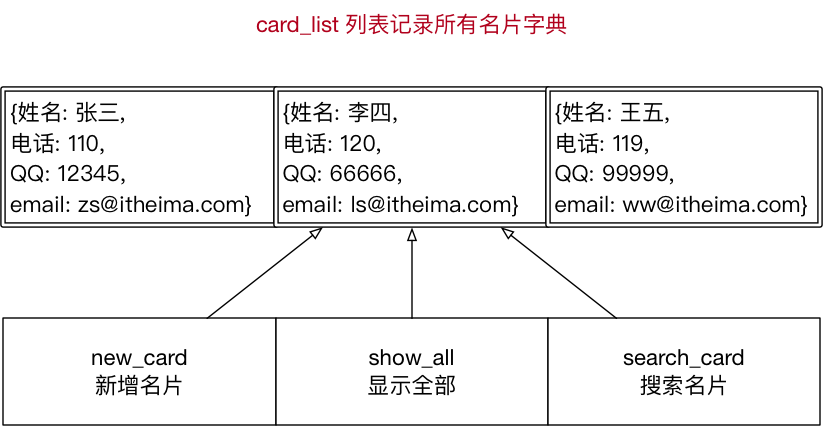

# 综合应用 —— 名片管理系统

## 目标

综合应用已经学习过的知识点：

* **变量**
* **流程控制**
* **函数**
* **模块**

开发 **名片管理系统**

## 系统需求

* 1. 程序启动，显示名片管理系统欢迎界面，并显示功能菜单

```
**************************************************
欢迎使用【名片管理系统】V1.0

1. 新建名片
2. 显示全部
3. 查询名片

0. 退出系统
**************************************************
```

* 2. 用户用数字选择不同的功能
* 3. 根据功能选择，执行不同的功能
* 4. 用户名片需要记录用户的 **姓名**、**电话**、**QQ**、**邮件**
* 5. 如果查询到指定的名片，用户可以选择 **修改** 或者 **删除** 名片

## 步骤

1. 框架搭建
2. 新增名片
3. 显示所有名片
4. 查询名片
5. 查询成功后修改、删除名片
6. 让 Python 程序能够直接运行

## 01. 框架搭建

**目标**

* 搭建名片管理系统 **框架结构**
    1. **准备文件**，确定文件名，保证能够 **在需要的位置** 编写代码
    2. 编写 **主运行循环**，实现基本的 **用户输入和判断**

### 1.1 文件准备

1. 新建 `cards_main.py` 保存 **主程序功能代码**
    * 程序的入口
    * 每一次启动名片管理系统都通过 `main` 这个文件启动 
2. 新建 `cards_tools.py` 保存 **所有名片功能函数**
    * 将对名片的 **新增**、**查询**、**修改**、**删除** 等功能封装在不同的函数中

### 1.2 编写主运行循环

* 在 `cards_main` 中添加一个 **无限循环**

```python

while True:

    # TODO(小明) 显示系统菜单

    action = input("请选择操作功能：")

    print("您选择的操作是：%s" % action)

    # 根据用户输入决定后续的操作
    if action in ["1", "2", "3"]:
        pass
    elif action == "0":
        print("欢迎再次使用【名片管理系统】")

        break
    else:
        print("输入错误，请重新输入")

```

#### 字符串判断

```python
if action in ["1", "2", "3"]:
```

```python
if action == "1" or action == "2" or action == "3":
```

1. 使用 `in` 针对 **列表** 判断，避免使用 `or` 拼接复杂的逻辑条件
2. 没有使用 `int` 转换用户输入，可以避免 **一旦用户输入的不是数字**，导致程序运行出错

#### pass

* `pass` 就是一个空语句，不做任何事情，一般用做占位语句
* 是为了保持程序结构的完整性

#### 无限循环

* 在开发软件时，如果 **不希望程序执行后** 立即退出
* 可以在程序中增加一个 **无限循环**
* **由用户来决定** 退出程序的时机

#### TODO 注释

* 在 `#` 后跟上 `TODO`，用于标记需要去做的工作

```python
# TODO(作者/邮件) 显示系统菜单
```

### 1.3 在 `cards_tools` 中增加四个新函数

```python
def show_menu():

    """显示菜单
    """
    pass

def new_card():

    """新建名片
    """
    print("-" * 50)
    print("功能：新建名片")


def show_all():

    """显示全部
    """
    print("-" * 50)
    print("功能：显示全部")


def search_card():

    """搜索名片
    """
    print("-" * 50)
    print("功能：搜索名片")

```

### 1.4 导入模块

* 在 `cards_main.py` 中使用 `import` 导入 `cards_tools` 模块

```python
import cards_tools
``` 

* 修改 `while` 循环的代码如下：

```python
import cards_tools

while True:

    cards_tools.show_menu()

    action = input("请选择操作功能：")

    print("您选择的操作是：%s" % action)

    # 根据用户输入决定后续的操作
    if action in ["1", "2", "3"]:

        if action == "1":
            cards_tools.new_card()

        elif action == "2":
            cards_tools.show_all()

        elif action == "3":
            cards_tools.search_card()

    elif action == "0":
        print("欢迎再次使用【名片管理系统】")

        break
    else:
        print("输入错误，请重新输入：")

```

> 至此：`cards_main` 中的所有代码全部开发完毕！


### 1.5 完成 `show_menu` 函数

```python
def show_menu():

    """显示菜单
    """
    print("*" * 50)
    print("欢迎使用【菜单管理系统】V1.0")
    print("")
    print("1. 新建名片")
    print("2. 显示全部")
    print("3. 查询名片")
    print("")
    print("0. 退出系统")
    print("*" * 50)

```

## 02. 保存名片数据的结构

**程序就是用来处理数据的，而变量就是用来存储数据的**

* 使用 **字典** 记录 **每一张名片** 的详细信息
* 使用 **列表** 统一记录所有的 **名片字典**



### 定义名片列表变量

* 在 `cards_tools` 文件的顶部增加一个 **列表变量**

```python
# 所有名片记录的列表
card_list = []
```

**注意**

1. **所有名片相关操作**，都需要使用这个列表，所以应该 **定义在程序的顶部**
2. **程序刚运行时，没有数据**，所以是 **空列表**

## 03. 新增名片

### 3.1 功能分析

1. 提示用户依次输入名片信息
2. 将名片信息保存到一个字典
3. 将字典添加到名片列表
4. 提示名片添加完成

### 3.2 实现 new_card 方法

* 根据步骤实现代码

```python
def new_card():

    """新建名片
    """
    print("-" * 50)
    print("功能：新建名片")

    # 1. 提示用户输入名片信息
    name = input("请输入姓名：")
    phone = input("请输入电话：")
    qq = input("请输入 QQ 号码：")
    email = input("请输入邮箱：")

    # 2. 将用户信息保存到一个字典
    card_dict = {"name": name,
                 "phone": phone,
                 "qq": qq,
                 "email": email}

    # 3. 将用户字典添加到名片列表
    card_list.append(card_dict)

    print(card_list)
    
    # 4. 提示添加成功信息
    print("成功添加 %s 的名片" % card_dict["name"])

```

> 技巧：在 `PyCharm` 中，可以使用 `SHIFT + F6` 统一修改变量名

## 04. 显示所有名片

### 4.1 功能分析

* 循环遍历名片列表，顺序显示每一个字典的信息

### 4.2 基础代码实现

```python
def show_all():

    """显示全部
    """
    print("-" * 50)
    print("功能：显示全部")

    for card_dict in card_list:

        print(card_dict)
        
```

* 显示效果不好！

### 4.3 增加标题和使用 `\t` 显示

```python
def show_all():
    """显示全部
    """
    print("-" * 50)
    print("功能：显示全部")

    # 打印表头
    for name in ["姓名", "电话", "QQ", "邮箱"]:
        print(name, end="\t\t")

    print("")

    # 打印分隔线
    print("=" * 50)

    for card_dict in card_list:

        print("%s\t\t%s\t\t%s\t\t%s" % (card_dict["name"],
                                        card_dict["phone"],
                                        card_dict["qq"],
                                        card_dict["email"]))
```

### 4.4 增加没有名片记录判断

```python
def show_all():
    """显示全部
    """
    print("-" * 50)
    print("功能：显示全部")

    # 1. 判断是否有名片记录
    if len(card_list) == 0:
        print("提示：没有任何名片记录")

        return

```

**注意**

* 在函数中使用 `return` 表示返回
* 如果在 `return` 后没有跟任何内容，只是表示该函数执行到此就不再执行后续的代码

## 05. 查询名片

### 5.1 功能分析

1. 提示用户要搜索的姓名
2. 根据用户输入的姓名遍历列表
3. 搜索到指定的名片后，再执行后续的操作

### 5.2 代码实现

* 查询功能实现

```python
def search_card():

    """搜索名片
    """
    print("-" * 50)
    print("功能：搜索名片")

    # 1. 提示要搜索的姓名
    find_name = input("请输入要搜索的姓名：")

    # 2. 遍历字典
    for card_dict in card_list:

        if card_dict["name"] == find_name:

            print("姓名\t\t\t电话\t\t\tQQ\t\t\t邮箱")
            print("-" * 40)
            
            print("%s\t\t\t%s\t\t\t%s\t\t\t%s" % (
                card_dict["name"],
                card_dict["phone"],
                card_dict["qq"],
                card_dict["email"]))

            print("-" * 40)
            
            # TODO(小明) 针对找到的字典进行后续操作：修改/删除

            break
    else:
        print("没有找到 %s" % find_name)

```

* 增加名片操作函数：**修改**/**删除**/**返回主菜单**

```python
def deal_card(find_dict):

    """操作搜索到的名片字典

    :param find_dict:找到的名片字典
    """
    print(find_dict)

    action_str = input("请选择要执行的操作 "
                       "[1] 修改 [2] 删除 [0] 返回上级菜单")

    if action == "1":
        print("修改")
    elif action == "2":
        print("删除")

```

## 06. 修改和删除

### 6.1 查询成功后删除名片

* 由于找到的字典记录已经在列表中保存
* 要删除名片记录，只需要把列表中对应的字典删除即可

```python
    elif action == "2":
        card_list.remove(find_dict)

        print("删除成功")
```

### 6.2 修改名片

* 由于找到的字典记录已经在列表中保存
* 要修改名片记录，只需要把列表中对应的字典中每一个键值对的数据修改即可

```python
    if action == "1":

        find_dict["name"] = input("请输入姓名：")
        find_dict["phone"] = input("请输入电话：")
        find_dict["qq"] = input("请输入QQ：")
        find_dict["email"] = input("请输入邮件：")

        print("%s 的名片修改成功" % find_dict["name"])

```

#### 修改名片细化

* **如果用户在使用时，某些名片内容并不想修改**，应该如何做呢？—— 既然系统提供的 `input` 函数不能满足需求，那么就新定义一个函数 `input_card_info` 对系统的 `input` 函数进行扩展

```python
def input_card_info(dict_value, tip_message):

    """输入名片信息

    :param dict_value: 字典原有值
    :param tip_message: 输入提示信息
    :return: 如果输入，返回输入内容，否则返回字典原有值
    """
    # 1. 提示用户输入内容
    result_str = input(tip_message)

    # 2. 针对用户的输入进行判断，如果用户输入了内容，直接返回结果
    if len(result_str) > 0:

        return result_str
    # 3. 如果用户没有输入内容，返回 `字典中原有的值`
    else:

        return dict_value

```

## 07. LINUX 上的 `Shebang` 符号(`#!`)

* `#!`这个符号叫做 `Shebang` 或者 `Sha-bang`
* `Shebang` 通常在 `Unix` 系统脚本的中 **第一行开头** 使用
* 指明 **执行这个脚本文件** 的 **解释程序**

### 使用 Shebang 的步骤

* 1. 使用 `which` 查询 `python3` 解释器所在路径

```bash
$ which python3
```

* 2. 修改要运行的 **主 python 文件**，在第一行增加以下内容

```python
#! /usr/bin/python3
```

* 3. 修改 **主 python 文件** 的文件权限，增加执行权限

```bash
$ chmod +x cards_main.py
```

* 4. 在需要时执行程序即可

```bash
./cards_main.py
```


