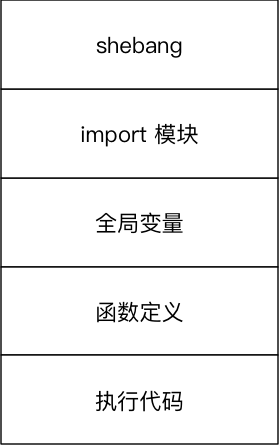

# 变量进阶（理解）

## 目标

* 变量的引用
* 可变和不可变类型
* 局部变量和全局变量

## 01. 变量的引用

> * 变量 和 数据 都是保存在 **内存** 中的
> * 在 `Python` 中 **函数 的 参数传递** 以及 **返回值** 都是靠 **引用** 传递的

### 1.1 引用的概念

在 `Python` 中

* **变量** 和 **数据** 是分开存储的
* **数据** 保存在内存中的一个位置
* **变量** 中保存着数据在内存中的地址
* **变量** 中 **记录数据的地址**，就叫做 **引用**
* 使用 `id()` 函数可以查看变量中保存数据所在的 **内存地址**

> 注意：如果变量已经被定义，当给一个变量赋值的时候，本质上是 **修改了数据的引用**
>
> * 变量 **不再** 对之前的数据引用
> * 变量 **改为** 对新赋值的数据引用

### 1.2 `变量引用` 的示例

在 `Python` 中，变量的名字类似于 **便签纸** 贴在 **数据** 上

* 定义一个整数变量 `a`，并且赋值为 `1`

| 代码 | 图示 |
| :---: | :---: |
| a = 1 | |

* 将变量 `a` 赋值为 `2`

| 代码 | 图示 |
| :---: | :---: |
| a = 2 | |

* 定义一个整数变量 `b`，并且将变量 `a` 的值赋值给 `b`

| 代码 | 图示 |
| :---: | :---: |
| b = a | |

> 变量 `b` 是第 2 个贴在数字 `2` 上的标签

### 1.3 函数的参数和返回值的传递

在 `Python` 中，函数的 **实参**/**返回值** 都是是靠 **引用** 来传递来的

```python
def test(num):

    print("-" * 50)
    print("%d 在函数内的内存地址是 %x" % (num, id(num)))

    result = 100

    print("返回值 %d 在内存中的地址是 %x" % (result, id(result)))
    print("-" * 50)

    return  result

a = 10
print("调用函数前 内存地址是 %x" % id(a))

r = test(a)

print("调用函数后 实参内存地址是 %x" % id(a))
print("调用函数后 返回值内存地址是 %x" % id(r))

```

## 02. 可变和不可变类型

* **不可变类型**，内存中的数据不允许被修改：
    * 数字类型 `int`, `bool`, `float`, `complex`, `long(2.x)`
    * 字符串 `str`
    * 元组 `tuple`
    
* **可变类型**，内存中的数据可以被修改：
    * 列表 `list`
    * 字典 `dict`

```python
a = 1
a = "hello"
a = [1, 2, 3]
a = [3, 2, 1]
```

```python
demo_list = [1, 2, 3]

print("定义列表后的内存地址 %d" % id(demo_list))

demo_list.append(999)
demo_list.pop(0)
demo_list.remove(2)
demo_list[0] = 10

print("修改数据后的内存地址 %d" % id(demo_list))

demo_dict = {"name": "小明"}

print("定义字典后的内存地址 %d" % id(demo_dict))

demo_dict["age"] = 18
demo_dict.pop("name")
demo_dict["name"] = "老王"

print("修改数据后的内存地址 %d" % id(demo_dict))

```

> 注意：字典的 `key` **只能使用不可变类型的数据**

**注意**

1. **可变类型**的数据变化，是通过 **方法** 来实现的
2. 如果给一个可变类型的变量，赋值了一个新的数据，**引用会修改**
    * 变量 **不再** 对之前的数据引用
    * 变量 **改为** 对新赋值的数据引用

### 哈希 `(hash)`

* `Python` 中内置有一个名字叫做 `hash(o)` 的函数
    * 接收一个 **不可变类型** 的数据作为 **参数**
    * **返回** 结果是一个 **整数**
* `哈希` 是一种 **算法**，其作用就是提取数据的 **特征码（指纹）**
    * **相同的内容** 得到 **相同的结果**
    * **不同的内容** 得到 **不同的结果**
* 在 `Python` 中，设置字典的 **键值对** 时，会首先对 `key` 进行 `hash` 已决定如何在内存中保存字典的数据，以方便 **后续** 对字典的操作：**增、删、改、查**
    * 键值对的 `key` 必须是不可变类型数据
    * 键值对的 `value` 可以是任意类型的数据

## 03. 局部变量和全局变量

* **局部变量** 是在 **函数内部** 定义的变量，**只能在函数内部使用**
* **全局变量** 是在 **函数外部定义** 的变量（没有定义在某一个函数内），**所有函数** 内部 **都可以使用这个变量**

> 提示：在其他的开发语言中，大多 **不推荐使用全局变量** —— 可变范围太大，导致程序不好维护！

### 3.1 局部变量

* **局部变量** 是在 **函数内部** 定义的变量，**只能在函数内部使用**
* 函数执行结束后，**函数内部的局部变量，会被系统回收**
* 不同的函数，可以定义相同的名字的局部变量，但是 **彼此之间** 不会产生影响

#### 局部变量的作用

* 在函数内部使用，**临时** 保存 **函数内部需要使用的数据**

```python
def demo1():

    num = 10

    print(num)

    num = 20

    print("修改后 %d" % num)


def demo2():

    num = 100

    print(num)

demo1()
demo2()

print("over")

```

#### 局部变量的生命周期

* 所谓 **生命周期** 就是变量从 **被创建** 到 **被系统回收** 的过程
* **局部变量** 在 **函数执行时** 才会被创建
* **函数执行结束后** 局部变量 **被系统回收**
* **局部变量在生命周期** 内，可以用来存储 **函数内部临时使用到的数据**

### 3.2 全局变量

* **全局变量** 是在 **函数外部定义** 的变量，所有函数内部都可以使用这个变量

```python
# 定义一个全局变量
num = 10


def demo1():

    print(num)


def demo2():

    print(num)

demo1()
demo2()

print("over")

```

**注意**：函数执行时，**需要处理变量时** 会：

1. **首先** 查找 **函数内部** 是否存在 **指定名称 的局部变量**，**如果有，直接使用**
2. 如果没有，查找 **函数外部** 是否存在 **指定名称 的全局变量**，**如果有，直接使用**
3. 如果还没有，程序报错！

#### 1) 函数不能直接修改 `全局变量的引用`

* **全局变量** 是在 **函数外部定义** 的变量（没有定义在某一个函数内），**所有函数** 内部 **都可以使用这个变量**

> 提示：在其他的开发语言中，大多 **不推荐使用全局变量** —— 可变范围太大，导致程序不好维护！

* 在函数内部，可以 **通过全局变量的引用获取对应的数据**
* 但是，**不允许直接修改全局变量的引用** —— 使用赋值语句修改全局变量的值

```python
num = 10


def demo1():

    print("demo1" + "-" * 50)

    # 只是定义了一个局部变量，不会修改到全局变量，只是变量名相同而已
    num = 100
    print(num)


def demo2():

    print("demo2" + "-" * 50)
    print(num)

demo1()
demo2()

print("over")

```

> 注意：只是在函数内部定义了一个局部变量而已，只是变量名相同 —— 在函数内部不能直接修改全局变量的值

#### 2) 在函数内部修改全局变量的值

* 如果在函数中需要修改全局变量，需要使用 `global` 进行声明

```python
num = 10


def demo1():

    print("demo1" + "-" * 50)

    # global 关键字，告诉 Python 解释器 num 是一个全局变量
    global num
    # 只是定义了一个局部变量，不会修改到全局变量，只是变量名相同而已
    num = 100
    print(num)


def demo2():

    print("demo2" + "-" * 50)
    print(num)

demo1()
demo2()

print("over")

```

#### 3) 全局变量定义的位置

* 为了保证所有的函数都能够正确使用到全局变量，应该 **将全局变量定义在其他函数的上方**

```python
a = 10


def demo():
    print("%d" % a)
    print("%d" % b)
    print("%d" % c)

b = 20
demo()
c = 30

```

**注意**

* 由于全局变量 c，是在调用函数之后，才定义的，在执行函数时，变量还没有定义，所以程序会报错！

**代码结构示意图如下**




#### 4) 全局变量命名的建议

* 为了避免局部变量和全局变量出现混淆，在定义全局变量时，有些公司会有一些开发要求，例如：
* 全局变量名前应该增加 `g_` 或者 `gl_` 的前缀

> 提示：具体的要求格式，各公司要求可能会有些差异


