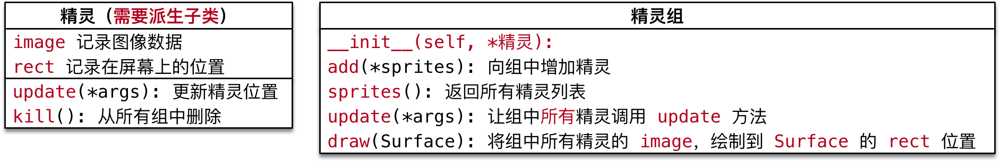

# 敌机出场

## 目标

* 使用 **定时器** 添加敌机
* 设计 `Enemy` 类

## 01. 使用定时器添加敌机

运行 **备课代码**，**观察** 敌机的 **出现规律**：

1. 游戏启动后，**每隔 1 秒** 会 **出现一架敌机**
2. 每架敌机 **向屏幕下方飞行**，飞行 **速度各不相同**
3. 每架敌机出现的 **水平位置** 也不尽相同
4. 当敌机 **从屏幕下方飞出**，不会再飞回到屏幕中

### 1.1 定时器

* 在 `pygame` 中可以使用 `pygame.time.set_timer()` 来添加 **定时器**
* 所谓 **定时器**，就是 **每隔一段时间**，去 **执行一些动作**

```python
set_timer(eventid, milliseconds) -> None
```

* `set_timer` 可以创建一个 **事件**
* 可以在 **游戏循环** 的 **事件监听** 方法中捕获到该事件
* 第 1 个参数 **事件代号** 需要基于常量 `pygame.USEREVENT` 来指定
    * `USEREVENT` 是一个整数，再增加的事件可以使用 `USEREVENT + 1` 指定，依次类推...
* 第 2 个参数是 **事件触发** 间隔的 **毫秒值**

**定时器事件的监听**

* 通过 `pygame.event.get()` 可以获取当前时刻所有的 **事件列表**
* **遍历列表** 并且判断 `event.type` 是否等于 `eventid`，如果相等，表示 **定时器事件** 发生

### 1.2 定义并监听创建敌机的定时器事件

`pygame` 的 **定时器** 使用套路非常固定：

1. 定义 **定时器常量** —— `eventid`
2. 在 **初始化方法** 中，调用 `set_timer` 方法 **设置定时器事件**
3. 在 **游戏循环** 中，**监听定时器事件**

#### 1) 定义事件

* 在 `plane_sprites.py` 的顶部定义 **事件常量**

```python
# 敌机的定时器事件常量
CREATE_ENEMY_EVENT = pygame.USEREVENT
```

* 在 `PlaneGame` 的 **初始化方法** 中 **创建用户事件**

```python
# 4. 设置定时器事件 - 每秒创建一架敌机
pygame.time.set_timer(CREATE_ENEMY_EVENT, 1000)
```

#### 2) 监听定时器事件

* 在 `__event_handler` 方法中增加以下代码：

```python
def __event_handler(self):
    
    for event in pygame.event.get():
    
        # 判断是否退出游戏
        if event.type == pygame.QUIT:
            PlaneGame.__game_over()
        elif event.type == CREATE_ENEMY_EVENT:
            print("敌机出场...")
```

## 02. 设计 `Enemy` 类

1. 游戏启动后，**每隔 1 秒** 会 **出现一架敌机**
2. 每架敌机 **向屏幕下方飞行**，飞行 **速度各不相同**
3. 每架敌机出现的 **水平位置** 也不尽相同
4. 当敌机 **从屏幕下方飞出**，不会再飞回到屏幕中


* **初始化方法**
    * 指定 **敌机图片**
    * **随机** 敌机的 **初始位置** 和 **初始速度**
* 重写 **update()** 方法
    * 判断 **是否飞出屏幕**，如果是，从 **精灵组** 删除

### 2.1 敌机类的准备

* 在 `plane_sprites` 新建 `Enemy` 继承自 `GameSprite`
* 重写 **初始化方法**，直接指定 **图片名称**
* 暂时 **不实现** **随机速度** 和 **随机位置** 的指定
* 重写 `update` 方法，判断是否飞出屏幕

```python
class Enemy(GameSprite):
    """敌机精灵"""
    
    def __init__(self):
        
        # 1. 调用父类方法，创建敌机精灵，并且指定敌机的图像
        super().__init__("./images/enemy1.png")

        # 2. 设置敌机的随机初始速度

        # 3. 设置敌机的随机初始位置
    
    def update(self):
        
        # 1. 调用父类方法，让敌机在垂直方向运动
        super().update()
        
        # 2. 判断是否飞出屏幕，如果是，需要将敌机从精灵组删除
        if self.rect.y >= SCREEN_RECT.height:
            print("敌机飞出屏幕...")    
```

### 2.2 创建敌机

**演练步骤**

1. 在 `__create_sprites`，添加 **敌机精灵组**
    * 敌机是 **定时被创建的**，因此在初始化方法中，不需要创建敌机
2. 在 `__event_handler`，创建敌机，并且 **添加到精灵组**
    * 调用 **精灵组** 的 `add` 方法可以 **向精灵组添加精灵**
3. 在 `__update_sprites`，让 **敌机精灵组** 调用 `update` 和 `draw` 方法



**演练代码**

* 修改 `plane_main` 的 `__create_sprites` 方法

```python
# 敌机组
self.enemy_group = pygame.sprite.Group()
```

* 修改 `plane_main` 的 `__update_sprites` 方法

```python
self.enemy_group.update()
self.enemy_group.draw(self.screen)
```

* 定时出现敌机

```python
elif event.type == CREATE_ENEMY_EVENT:
    self.enemy_group.add(Enemy())
```

### 2.3 随机敌机位置和速度

#### 1) 导入模块

* 在导入模块时，**建议** 按照以下顺序导入

```python
1. 官方标准模块导入
2. 第三方模块导入
3. 应用程序模块导入
```

* 修改 `plane_sprites.py` 增加 `random` 的导入

```python
import random
```

#### 2) 随机位置


使用 `pygame.Rect` 提供的 `bottom` 属性，在指定敌机初始位置时，会比较方便

*  `bottom = y + height`
*  `y = bottom - height`

#### 3) 代码实现

* 修改 **初始化方法**，随机敌机出现 **速度** 和 **位置**

```python
def __init__(self):

    # 1. 调用父类方法，创建敌机精灵，并且指定敌机的图像
    super().__init__("./images/enemy1.png")

    # 2. 设置敌机的随机初始速度 1 ~ 3
    self.speed = random.randint(1, 3)

    # 3. 设置敌机的随机初始位置
    self.rect.bottom = 0
    
    max_x = SCREEN_RECT.width - self.rect.width
    self.rect.x = random.randint(0, max_x)
```

### 2.4 移出屏幕销毁敌机

* 敌机移出屏幕之后，如果 **没有撞到英雄**，敌机的历史使命已经终结
* 需要从 **敌机组** 删除，否则会造成 **内存浪费**

#### 检测敌机被销毁

* `__del__` 内置方法会在对象被销毁前调用，在开发中，可以用于 **判断对象是否被销毁**

```python
def __del__(self):
    print("敌机挂了 %s" % self.rect)
```

#### 代码实现


* 判断敌机是否飞出屏幕，如果是，调用 `kill()` 方法从所有组中删除

```python
def update(self):
    super().update()
    
    # 判断敌机是否移出屏幕
    if self.rect.y >= SCREEN_RECT.height:
        # 将精灵从所有组中删除
        self.kill()
```


